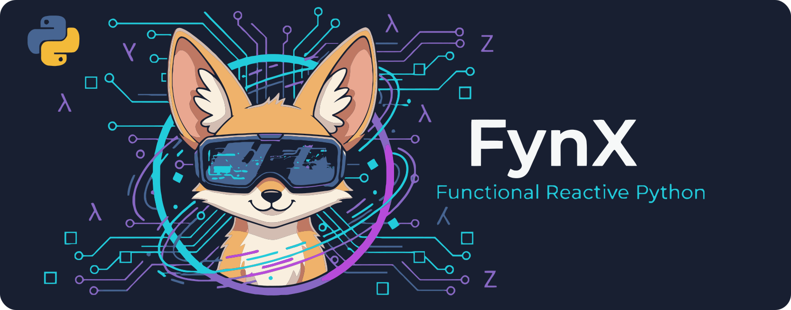

<div style="background: linear-gradient(135deg, #667eea 0%, #764ba2 100%); color: white !important; padding: 20px; border-radius: 12px; margin: 20px 0; box-shadow: 0 4px 6px rgba(0,0,0,0.1); text-align: center;">
  <h3 style="margin: 0 0 10px 0; font-size: 1.2em; color: white !important;">🚧 Documentation Under Construction</h3>
  <p style="margin: 0; font-size: 1em; line-height: 1.5; color: white !important;">Hey! You got here early! FynX is still incredibly new, so we're still ironing out the documentation here. Thanks for your patience and early interest!</p>
</div>

# FynX

<p align="center">
  
</p>

<p align="center">
  <a href="https://pypi.org/project/fynx/">
    
  </a>
  <a href="https://github.com/off-by-some/fynx/actions/workflows/test.yml">
    
  </a>
  <a href="https://codecov.io/github/off-by-some/fynx" >
    
  </a>
  <a href="https://www.python.org/downloads/">
    
  </a>
  <a href="https://opensource.org/licenses/MIT">
    
  </a>
</p>

<p align="center"><i>FynX ("Finks") = Functional Yielding Observable Networks</i></p>


## Overview

FynX is a lightweight reactive state management library for Python that brings the elegance of reactive programming to your applications. Inspired by MobX, FynX eliminates the complexity of manual state synchronization by automatically propagating changes through your application's data flow. When one piece of state changes, everything that depends on it updates automatically—no boilerplate, no explicit update calls, just transparent reactivity.


## Installation

Install FynX from PyPI using pip:

```bash
pip install fynx
```

FynX has no required dependencies and works with Python 3.9 and above.


## Why Use FynX?

**Transparent Reactivity**: FynX requires no special syntax. Use standard Python assignment, method calls, and attribute access—reactivity works automatically without wrapper objects or proxy patterns.

**Automatic Dependency Tracking**: FynX observables track their dependents automatically during execution. You never manually register or unregister dependencies; the framework infers them from how your code actually runs.

**Lazy Evaluation with Memoization**: Computed values only recalculate when their dependencies change, and only when accessed. This combines the convenience of automatic updates with the performance of intelligent caching.

**Composable Architecture**: Observables, computed values, and reactions compose naturally. You can nest stores, chain computed values, and combine reactions to build complex reactive systems from simple, reusable pieces.

**Expressive Operators**: FynX provides intuitive operators (`+`, `>>`, `&`, `~`, `|`) that let you compose reactive logic clearly and concisely, making your data flow explicit and easy to understand.


## Understanding Reactive Programming

Traditional imperative programming requires you to manually orchestrate updates: when data changes, you must explicitly call update methods, refresh UI components, or invalidate caches. This creates brittle, error-prone code where it's easy to forget an update or create inconsistent states.

Reactive programming inverts this model. Instead of imperatively triggering updates, you declare relationships between data. When a value changes, the framework automatically propagates that change to everything that depends on it. Think of it like a spreadsheet: when you change a cell, all formulas referencing that cell recalculate automatically. FynX brings this same automatic dependency tracking and update propagation to Python.

What makes FynX special is its transparency. You don't need to learn special syntax or wrap everything in framework-specific abstractions. Just use normal Python objects and assignment—FynX handles the reactivity behind the scenes through automatic dependency tracking.


## Quick Start Example

Here's a complete example showing how FynX's concepts work together:

```python
from fynx import Store, observable, reactive, watch

# Create a reactive store grouping related state
class UserStore(Store):
    name = observable("Alice")
    age = observable(30)
    is_online = observable(False)

    # Computed property that automatically updates when dependencies change
    greeting = (name + age) >> (
        lambda n, a: f"Hello, {n}! You are {a} years old."
    )

# React to any change in name or age
@reactive(UserStore.name, UserStore.age)
def on_user_change(name, age):
    print(f"User updated: {name}, {age}")

# React only when specific conditions are met
is_adult_online = (UserStore.is_online >> (lambda online: online)) & (UserStore.age >> (lambda age: age >= 18))
@reactive(is_adult_online)
def on_adult_online(is_adult_online_state):
    if is_adult_online_state:
        print(f"Adult user {UserStore.name.value} is now online!")

# Changes trigger appropriate reactions automatically
UserStore.name = "Bob"      # Prints: User updated: Bob, 30
UserStore.age = 25          # Prints: User updated: Bob, 25
UserStore.is_online = True  # Prints: Adult user Bob is now online!
```

Notice how natural the code looks—no explicit update calls, no subscription management, just straightforward Python that happens to be reactive.


## Core Concepts

FynX's design centers on four fundamental building blocks that work together to create reactive data flows:

### Observables

Observables are the foundation of reactivity. An observable is simply a value that FynX watches for changes. When you modify an observable, FynX automatically notifies everything that depends on it. Think of observables as the source nodes in your application's dependency graph—they're the raw state that drives everything else.

### Computed Values

Computed values are derived data that automatically recalculates when their dependencies change. They provide memoization by default, meaning they only recompute when one of their inputs actually changes—not on every access. This makes them both convenient and performant for expensive calculations. Computed values form the intermediate nodes in your dependency graph, transforming observables into the exact shape your application needs.

### Reactions

Reactions are side effects that execute automatically when their observed dependencies change. Use reactions for actions like updating a UI, making an API call, logging, or any other effect that should happen in response to state changes. While observables and computed values represent your data, reactions represent what your application does with that data.

### Stores

Stores provide organizational structure by grouping related observables, computed values, and methods together. They offer convenient patterns for subscribing to changes and managing related state as a cohesive unit. Stores aren't required, but they help you organize complex state into logical, reusable components.

### Conditional Reactions

Conditional reactions extend the basic reaction pattern by only executing when specific conditions are met. They're perfect for implementing state machines, validation rules, or any scenario where you need fine-grained control over when effects trigger. This allows you to express complex conditional logic declaratively rather than scattering imperative checks throughout your code.


## Common Patterns

As you work with FynX, you'll find these patterns emerge naturally:

**State Management**: Group related observables in Store classes to create logical boundaries in your application. Each store becomes a self-contained module of state with its own computed values and methods.

**Derived Data**: Use computed values whenever you need data that depends on other data. The automatic memoization means you can freely access computed values without worrying about performance—they only recalculate when necessary.

**Side Effects**: Attach reactions to observables for any effect that should happen in response to state changes: updating a UI, sending analytics, making API calls, or writing to a database.

**Conditional Logic**: Use watch decorators to implement state machines, validation rules, or event filtering. This keeps conditional logic declarative and colocated with the relevant state.

**Data Flow Composition**: Use FynX's operators (`+` for piping values, `>>` for chaining, `&` for combining) to build clear, expressive data transformation pipelines.

## Documentation

- [API Reference](generation/markdown/api.md) - Complete API documentation with organized sections
- [Examples](https://github.com/off-by-some/fynx/tree/main/examples) - Working examples and patterns
- [GitHub Repository](https://github.com/off-by-some/fynx) - Source code and issues

## Contributing

We welcome contributions! Please visit the [GitHub repository](https://github.com/off-by-some/fynx) for contribution guidelines, issue tracking, and development setup instructions.

## License

FynX is released under the MIT License. See the [LICENSE](https://github.com/off-by-some/fynx/blob/main/LICENSE) file for complete terms.
